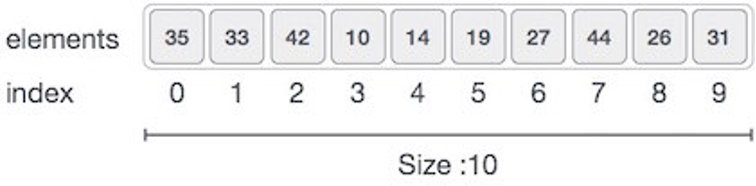

# Array
## 定义
数组是内存中连续分配的多元素结构，通过下标访问， 数组下标从0开始。



```c++
// c++ Implementation
// 初始化
int nums[5] = { 1, 2, 3, 4, 5 }; 

// 赋值
nums[0] = 100;  //O(1)

// 使用
int t = nums[0]; // 时间复杂度为O(1)

// c++ also provide vector as daynamic array container
```

优点:
- 按照index查询，遍历数组速度快

缺点:
- 数组大小固定就无法改变
- 只能存储一种数据结构
- 添加，删减 操作 慢， 因为移动其他元素

## 使用 
一般用于对存储空间要求不大， 很少增加和删除的情况