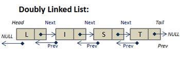

# Doubly Linked List

In computer science, a **doubly linked list** is a linked data structure that
consists of a set of sequentially linked records called nodes. Each node contains
two fields, called links, that are references to the previous and to the next
node in the sequence of nodes.

