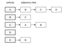
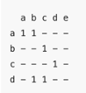

# Graph
## 定义
多对多"逻辑关系数 据的结构——图存储结构。node and edge


- undirected vs directed
- cyclic vs acyclic

edge本身可以有权重


## 图的表示有两种主要方式: 
- 邻接表

  

- 邻接矩阵

  

```c++
// c++ Implementation
// TODO

```

## 考察 algorithms
- 一般基本 BFS, DFS，拓扑排序即可 深入学习可考虑最短路径，最小生成 树等。
- 找环