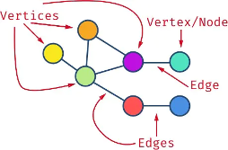
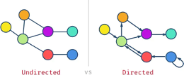
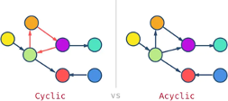
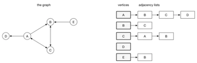
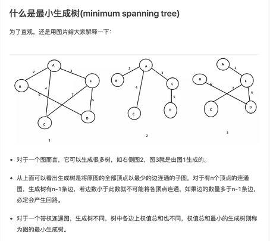

# Graph
## 1. 定义
- 多对多"逻辑关系数 据的结构——图存储结构。
- 一组定点： v （Vertex) / 一组边： E （edge)
- edge 本身可以有权重
- 不考虑重边和自回路

> 

<br/>

## 2. connected graph
对于任意两个节点， 有路径， 则称是连通图

<br/>

## 3. undirected vs directed
> 

<br/>

## 4. cyclic vs acyclic
> 

<br/>

## 5. 图的表示:
- 邻接表 (adjacency list)

  

  ```c++
  // c++ Implementation
  unodered_map<char, vector<char>> graph;
  for(int i = 0; i < N; i++){
    graph[i] = {};
  }

  // edges
  graph['A'].push_back('B');
  graph['A'].push_back('C');
  graph['A'].push_back('D');

  graph['B'].push_back('C');

  graph['C'].push_back('A');
  graph['C'].push_back('B');

  graph['E'].push_back('B');
  ```

- 邻接矩阵 (adjacency matrix)
  
  

  ```c++
  // c++ Implementation
  vector<vector<int>> graph(N, vector<int>(N, 0));

  // A => 0
  // B => 1
  // C => 2
  // D => 3
  // E => 4

  // edges
  graph[0][1] = 1;
  graph[0][2] = 1;
  graph[0][3] = 1;

  graph[1][2] = 1;

  graph[2][0] = 1;
  graph[2][1] = 1;

  graph[4][1] = 1;
  ```
<br/>

## 6. Topological Sort 拓扑排序
在图论中，拓扑排序（Topological Sorting）是一个有向无环图（DAG, Directed Acyclic Graph）的所有顶点的线性序列。且该序列必须满足下面:
- 每个顶点出现且只出现一次。
- 若存在一条从顶点 A 到顶点 B 的路径，那么在序列中顶点 A 出现在顶点 B 的前面。
- 有向无环图（DAG）才有拓扑排序，非DAG图没有拓扑排序一说

<br/>

实现方式： 
- BFS Kahn算法, 基于贪心，每次从入度为0的点开始，正序为拓扑
- DFS 基于搜索，每次保证当前点出度为0后才遍历, 逆序为拓扑 (单纯拓扑不推荐DFS, 如果是二分图才用DFS)

<br/>

Kahn入度算法
1. 从图中选择一个入度为0的顶点， 输出该节点。
2. 从图中删除该节点和所有边。（相邻顶点入度-1）
3. 反复执行， 直至所有节点都输出， 或者图中如果有入度不为零的节点，则说明图中有环

```c++
// c++ Implementation
void kahn_bfs(vector<vector<int> >& edges, int N){
  // build graph and indegree
  unodered_map<int, vector<int>> g;
  vector<int> indegree(N, 0);

  for(vector<int> edge : edges){
    int end = edge[0];
    int start = edge[1];
    if(g.find(start) == g.end()){
      g[start] = {};
    }
    g[start].push_back(end);
    indegree[end]++;
  }

  // 入度为0的节点
  deque<int> q;
  for(int i = 0; i < N; i++){
    if(indegree[i] == 0){
      q.push_back(i);
    }
  }

  int count = 0;
  while(!q.empty()){
    int cur = q.front(); q.pop_front();
    
    // Print output
    cout<<cur<<endl;

    count++;
    for(int n : graph[cur]){
      if(--indegree[n] == 0) q.push_back(n)
    }
  }

  // Check if the graph has cycle
  if(count != N) {
    cout<<"Found Cycle!!"<<endl;
  }else{
    cout<<"No Cycle!!"<<endl;
  }

  return;
}
```
<br/>

DFS 法:
对于图中的任意一个节点，它在搜索的过程中有三种数字颜色状态，即：
- 「0 白色 未搜索」：我们还没有搜索到这个节点；

- 「1 灰色 搜索中」：我们搜索过这个节点，但还没有回溯到该节点，即该节点还没有入栈，还有相邻的节点没有搜索完成）；

- 「2 黑色 已完成」：我们搜索过并且回溯过这个节点，即该节点已经入栈，并且所有该节点的相邻节点都出现在栈的更底部的位置，满足拓扑排序的要求。

```c++
vector<int> visited;
bool valid = true;

void topological_dfs(int N, vector<vector<int> > edges){
    // 建图 和 建visited int[] 
    visited.resize(N, 0);
    unodered_map<int, vector<int>> g;

    for(vector<int> edge : edges){
      int end = edge[0];
      int start = edge[1];
      if(g.find(start) == g.end()){
        g[start] = {};
      }
      g[start].push_back(end);
    }

    // DFS
    if(visited[i] == 0) _dfs(i, g);

    if(valid == false){
      cout << "Found Cycle!!" <<endl;
    } else {
      cout << "No Cycle!!" <<endl;
    }

    return;
}

/*
遍历当前点为进行中灰色1
遍历neighbor:    遇到1则有环, 遇到0继续dfs
所有neighbor遍历结束，标记当前点为黑色2，已遍历结束
*/

void _dfs(int u, unodered_map<int, vector<int>>& g){
  visited[u] = 1;
  for(int n : g[u]){
    if(visited[n] == 0) _dfs(n);
    if(visited[n] == 1) valid = false;
  }
  visited[u] = 2;

  // print out (reverse order)
  cout<<u<<endl;
  return;
}

```

<br/>

## 7. 无向图找环
1. DFS + parent
2. Union Find

<br/>

## 8. Minimum Spanning Tree


The cost of the spanning tree is the sum of the weights of all the edges in the tree. There can be many spanning trees. Minimum spanning tree is the spanning tree where the cost is minimum among all the spanning trees. There also can be many minimum spanning trees.

### MST 算法
- Prim Native implementation O(V^2)  --> 稠密图
- Prim PQ implementation O((V+E)logV)    --> 稀疏图
- kruskal uf implementation O(ElogV) --> 稀疏图

### Prim PQ
1. 以某一个点开始， 寻找当前该点可以访问所有的边
2. 发现最小边并且这个边的target还没有访问过，将还没有访问过的点加入集合，记录添加的边。
3. 重复2，直到没有新的点可以加入
4. 此时所有的边构成即为最小生成树

### Prim Naive 
> 

### Kruskal
1. 按照边的权重从小到大进行排序
2. 依次将每条边的两端点不属于同一集合，那就将他们合并（并查集）
3. 直到所有点都进入一个集合中

## Leetcode questions
1. Topological sort 拓扑排序 (有向图找环)
- [207 Course Schedule](../leetcode_questions/207_course_schedule.md)
- [210 Course Schedule II](../leetcode_questions/210_course_schedule_ii.md)
- [269 Alien Dictionary](../leetcode_questions/269_alien_dictionary.md)
- [2127 Maximum Employees to Be Invited to a Meeting](../leetcode_questions/2127_maximum_employees_to_be_invited_to_a_meeting.md)

2. (无向图找环)  => Union find / DFS with parent
- [261 Graph Valid Tree](../leetcode_questions/261_graph_valid_tree.md)

3. Minimum Spanning Tree
- [1168 Optimize Water Distribution in a Village](../leetcode_questions/1168_optimize_water_distribution_in_a_village.md)
- [1135 Connecting Cities With Minimum Cost](../leetcode_questions/1135_connecting_cities_with_minimum_cost.md)
- [1584 Min Cost to Connect All Points](../leetcode_questions/1584_min_cost_to_connect_all_points.md)
- [1489 Find Critical and Pseudo-Critical Edges in Minimum Spanning Tree](../leetcode_questions/1489_find_critical_and_pseudo_critical_edges_in_minimum_spanning_tree.md)

4. Shortest Path

5. Strong Connect Components
