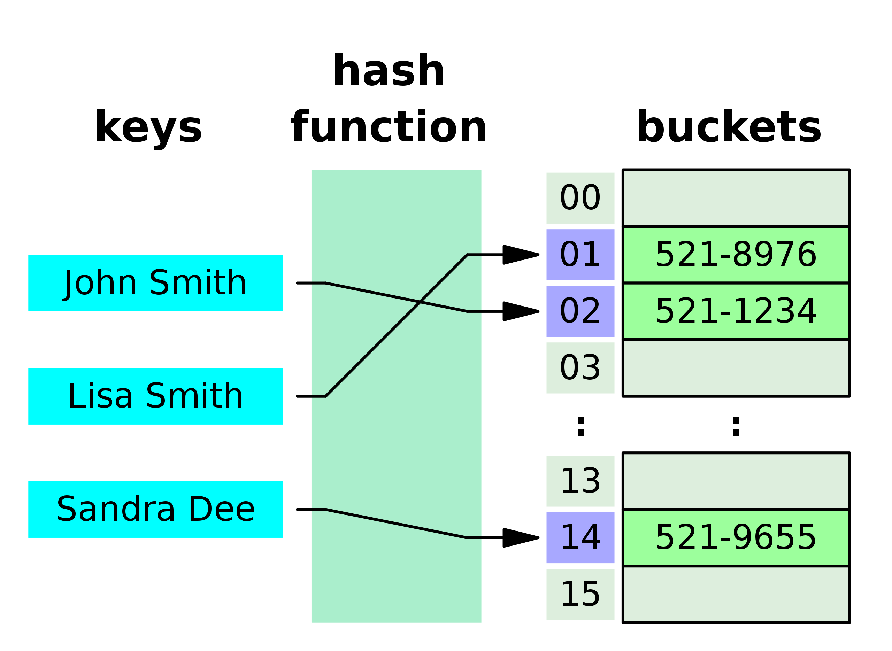

# HashMap

## 定义
散列表，也叫哈希表，是根据关键码和值 (key和value) 直接进行访问的 data structure 通过key和value来映射到集合中的一个位置，这样就可以很快找到集合中的对应元素。

记录的存储位置=f(key)

这里的对应关系 f 成为散列函数，又称为哈希 (hash函数)，而散列表就是把Key通 过一个固定的算法函数既所谓的哈希函数转换成一个整型数字，然后就将该数字对数组长度进行取余，取余结果就当作数组的下标，将value存储在以该数字为下 标的数组空间里，这种存储空间可以充分利用数组的查找优势来查找元素，所以查找的速度很快。



```c++
// c++ Implementation
std::unordered_map<int, int> m;

m[44] = 11;
m[11] = 33;
int r = m.at(11);  // 33
m.erase(44);
m.insert({22, 66});
```
## O(1) 插入和查找

## 如果2个不同的string input作为key在hashmap中index 出现了冲突如何处理?
一般使用两种方法
1. 挂链表 Separate Chaining
2. 开放地址法 open addressing

好处:查找比纯链表快，插入删除比纯数组快