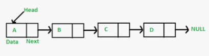

# Linked List
## 定义
链表是非连续，非顺序储存结构， 每个node包含数据和指针两部分


```c++
// c++ Implementation
struct {
    Node* ptr;
    int val;
} Node;

Node * ptr = new Node(1);
ptr->next = new Node(2);
int v = ptr->val;
```
赋值取值时间复杂度O(1)

优点：
- 可以随意添加减元素。
- 添加删除元素只需要改变前后节点指针

缺点
- 占用空间大
- 查找需要遍历

## 适用场景
需要频繁增加删除， 删除操作的场景