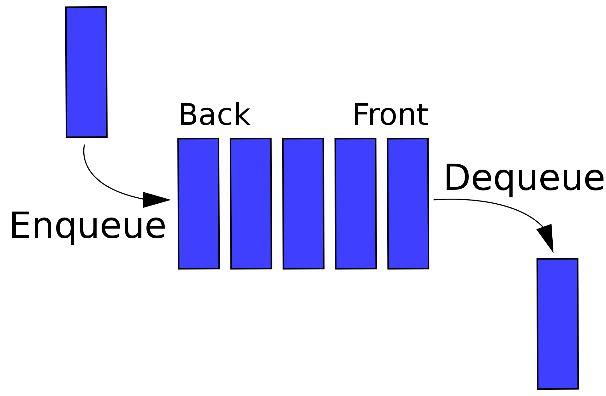

# Queue
## 定义
队列与栈一样，也是一种线性表，不同的是，队列可以在 一端添加元素，在另一端取出元素，也就是:先进先出。



First In First Out (FIFO)


# Deque (Double ended queue)

## 定义
如果把条件放松一下，允许两头都进，两头都出，这种队列叫双 端队列(Double Ended Queue)，学名Deque (deck)。

```c++
// c++ Implementation
#include <deque>

std::deque<int> q;
q.push_back(5);
q.push_front(1);
q.pop_back();
q.pop_front();
```

```c++
// c++ Implementation
#include <stack>

std::queue<int> q;
q.push(5);
q.pop();
int f = q.front();
```

##
常用来实现BFS 宽度优先搜索的遍历

## Leetcode questions
- [225 Implement Stack using Queues](../leetcode_questions/225_implement_stack_using_queue.md)
- [622 Design Circular Queue](../leetcode_questions/622_design_circular_queue.md)
- [641 Design Circular Deque](../leetcode_questions/641_design_circular_deque.md)