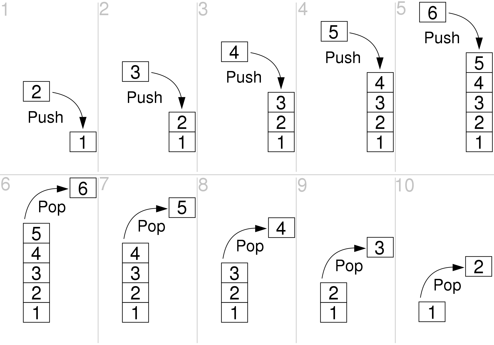

# Stack
## 定义
栈是一种特殊的线性表，仅能在线性表的一端操 作，栈顶允许操作，栈底不允许操作。先进后出，或者说是后进先出，从栈顶放入元 素的操作叫入栈，取出元素叫出栈



Last In First Out (LIFO) or First In Last Out (FILO)


```c++
// c++ Implementation
#include <stack>

stack<int> stk; // 常用method,时间复杂度均为O(1) 
stack.push(5)
stack.top()
stack.pop()
stack.isempty() //查看栈是否为空
```

## 应用
栈常应用于实现递归功能方面的场景，DFS均可以使用栈来实现