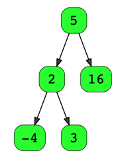
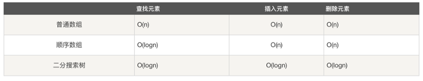

# Tree

## 定义
树是一种数据结构:
每个节点有零个或多个子节点; 没有父节点的节点称为根节点;
每一个非根节点有且只有一个父节点; 
除了根节点外，每个子节点可以分为多个不相交的子树;

Binary Tree二叉树是树的特殊一种，具 有如下特点:
- 每个结点最多有两颗子树


```c++
// c++ Implementation
class TreeNode {
public:
    TreeNode* left;
    TreeNode* right;
    int val;
    TreeNode(int n){
        val = n;
        left = NULL;
        right = NULL;
    }
}

TreeNode* root = new TreeNode(0); 
root->left  = new TreeNode(1); 
root->right = new TreeNode(2);
```

## Binary Search Tree :
- Binary Tree
- 左子树和右子树是有顺序的 
- 查找元素时间复杂度：lg(N)



- BST 性质



## Perfect Binary Tree /  Full Binary Tree / Complete Binary Tree


- BST 查找
```c++
// recursive
TreeNode* search(TreeNode* root, int target){
    if(root == NULL || root->val == target) return root;
    if(root->val < target) return search(root->right, target);

    return search(root->left, target);
}

// iterative
TreeNode* search(TreeNode* root, int target){
    TreeNode* cur = root;

    while(true){
        if(cur == NULL) return NULL;
        if(cur->val == target) return cur;
        if(cur->val < target) cur = cur->left;
        else cur = cur->right;
    }
    
    return NULL;
}
```

- BST 添加
```c++
// recursive
TreeNode* insert(TreeNode* root, int target){
    if(root == NULL){
        root = new TreeNode(target);
        return root;
    }

    if(target < root->val) root->left = insert(root->left, target);
    else if(target > root->val) root->right = insert(root->right, target);

    return root;
}

// iterative
TreeNode* insert(TreeNode* root, int target){
    TreeNode* cur = root;
    TreeNode* newNode = new TreeNode(target);
    if(cur == NULL){
        cur = newNode;
        return cur;
    }

    TreeNode* prev = NULL;
    while(cur != NULL){
        prev = cur;
        if(cur->val < target) cur = cur.right;
        else cur = cur->left;
    }

    if(prev->val < target) prev->right = newNode;
    else prev->left = newNode;

    return root;
}

```

- BST 删减
=> leetcode 450

## Balanced Binary Tree
左右两个子树的高度绝对值布超过1， 并且左右两个子树都是一个平衡树， 平衡二叉树必定是平衡搜索树。
- AVL tree
- red-black tree
- B, B-, B+ tree

## 树的遍历
- preorder  (根左右)
- inorder   (左根右) 
- postorder (左右根)


```c++
// c++ Implementation
// Resusive
vector<int> treeTraversal(TreeNode* root){
    vector<int> ans;
    helper(root, ans);
    return ans;
}

// preorder
void helper(TreeNode* root, vector<int>& ans){
    if(root == NULL) return;
    ans.push_back(root->val);
    helper(root->left, ans);
    helper(root->right, ans);
}

// inorder
void helper(TreeNode* root, vector<int>& ans){
    if(root == NULL) return;
    helper(root->left, ans);
    ans.push_back(root->val);
    helper(root->right, ans);
}

// postorder
void helper(TreeNode* root, vector<int>& ans){
    if(root == NULL) return;
    helper(root->left, ans);
    helper(root->right, ans);
    ans.push_back(root->val);
}
```

## LCA Problem
Given a binary tree, find the lowest common ancestor of two (or more) given nodes in tree.
- 倍增、Tarjan、树链剖分 (TODO)


## Leetcode questions
1. 遍历
- [144 Binary Tree Preorder Traversal](../leetcode_questions/144_binary_tree_preorder_traversal.md)
- [94 Binary Tree Inorder Traversal](../leetcode_questions/94_binary_tree_inorder_traversal.md)
- [145 Binary Tree Postorder Traversal](../leetcode_questions/145_binary_tree_postorder_traversal.md)
- [102 Binary Tree Level Order Traversal](../leetcode_questions/102_binary_tree_level_order_traversal.md)
- [103 Binary Tree Zigzig Level Order Traversal](../leetcode_questions/103_binary_tree_zigzig_level_order_traversal.md)
- [107 Binary Tree Level Order Traversal II](../leetcode_questions/107_binary_tree_level_order_traversal_II.md)
- [314 Binary Tree Vertical Order Traversal](../leetcode_questions/314_binary_tree_vertical_order_traversal.md)
- [987 Vertical Order Traversal of a Binary Tree](../leetcode_questions/987_vertical_order_traversal_of_a_binary_tree.md)

2. 结构转换/序列化
- [297 Serialize and Deserialize Binary Tree](../leetcode_questions/297_serialize_and_deserialize_binary_tree.md)
- [428 Serialize and Deserialize N-ary Tree](../leetcode_questions/428_serialize_and_deserialize_nary_tree.md)
- [449 Serialize and Deserialize BST](../leetcode_questions/449_serialize_and_deserialize_BST.md)
- [1008 Construct Binary Search Tree from Preorder Traversal](../leetcode_questions/1008_construct_binary_search_tree_from_preorder_traversal.md)
- [105 Construct Binary Tree from Preorder and Inorder Traversal](../leetcode_questions/105_construct_binary_tree_from_preorder_and_inorder_traversal.md)
- [106 Construct Binary Tree from Inorder and Postorder Traversal](../leetcode_questions/106_construct_binary_tree_from_inorder_and_postorder_traversal.md)
- [889 Construct Binary Tree from Preorder and Postorder Traversal](../leetcode_questions/889_construct_binary_tree_from_preorder_and_postorder_traversal.md)
- [426 Convert Binary Search Tree to Sorted Doubly Linked List](../leetcode_questions/426_convert_binary_search_tree_to_sorted_doubly_linked_list.md)

3. BST
- [270 Closest Binary Search Tree Value](../leetcode_questions/270_closest_binary_search_tree_value.md)
- [450 Delete Node in BST](../leetcode_questions/450_delete_node_in_BST.md)
- [98 Validate Binary Search Tree](../leetcode_questions/98_validate_binary_search_tree.md)
- [173 Binary Search Tree Iterator](../leetcode_questions/173_binary_search_tree_iterator.md)
- [99 Recover Binary Search Tree](../leetcode_questions/99_recover_binary_search_tree.md)
- [108 Convert Sorted Array to Binary Search Tree](../leetcode_questions/108_convert_sorted_array_to_binary_search_tree.md)
- [1382 Balance a Binary Search Tree](../leetcode_questions/1382_balance_a_binary_search_tree.md)
- [96 Unique Binary Search Trees](../leetcode_questions/96_unique_binary_search_trees.md)
- [95 Unique Binary Search Trees II](../leetcode_questions/95_unique_binary_search_trees_ii.md)

4. LCA
- [235 Lowest Common Ancestor of a Binary Search Tree](../leetcode_questions/235_lowest_common_ancestor_of_a_binary_search_tree.md)
- [236 Lowest Common Ancestor of a Binary Tree](../leetcode_questions/236_lowest_common_ancestor_of_a_binary_tree.md)
- [1644 Lowest Common Ancestor of a Binary Tree II](../leetcode_questions/1644_lowest_common_ancestor_of_a_binary_tree_ii.md)
- [1650 Lowest Common Ancestor of a Binary Tree III](../leetcode_questions/1650_lowest_common_ancestor_of_a_binary_tree_iii.md)
- [1676 Lowest Common Ancestor of a Binary Tree IV](../leetcode_questions/1676_lowest_common_ancestor_of_a_binary_tree_iv.md)
- [1123 Lowest Common Ancestor of Deepest Leaves](../leetcode_questions/1123_lowest_common_ancestor_of_deepest_leaves.md)
- [865 Smallest Subtree with all the Deepest Nodes](../leetcode_questions/865_smallest_subtree_with_all_the_deepest_nodes.md)