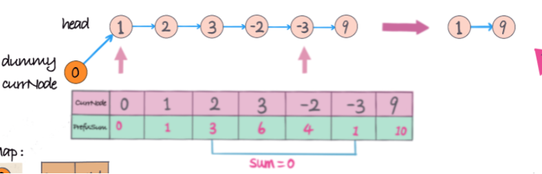

# 1171. Remove Zero Sum Consecutive Nodes from Linked List

## Question link
(https://leetcode.com/problems/remove-zero-sum-consecutive-nodes-from-linked-list/)

## Question Description
Given the head of a linked list, we repeatedly delete consecutive sequences of nodes that sum to 0 until there are no such sequences.

After doing so, return the head of the final linked list.  You may return any such answer.

(Note that in the examples below, all sequences are serializations of ListNode objects.)

Example 1:
> Input: head = [1,2,-3,3,1]
>
> Output: [3,1]
> 
> Note: The answer [1,2,1] would also be accepted.

Example 2:
> Input: head = [1,2,3,-3,4]
> 
> Output: [1,2,4]

Example 3:
> Input: head = [1,2,3,-3,-2]
> 
> Output: [1]


Constraints:
- The given linked list will contain between 1 and 1000 nodes.
- Each node in the linked list has -1000 <= node.val <= 1000.

## 分类
- linkedlist
- prefix


## 解题思路
2 sum + prefixSum 的结合，prefixsum array中相同value的两个点之间的subarray的sum必然为0
我们在第一次做prefixSum的时候只保存最后一次相同的value，这样在第二次遍历的时候可以直接跳过。



## Code Implementation
```c++
/**
 * Definition for singly-linked list.
 * struct ListNode {
 *     int val;
 *     ListNode *next;
 *     ListNode() : val(0), next(nullptr) {}
 *     ListNode(int x) : val(x), next(nullptr) {}
 *     ListNode(int x, ListNode *next) : val(x), next(next) {}
 * };
 */

// prefix
class Solution {
public:
    ListNode* removeZeroSumSublists(ListNode* head) {
        int prefix = 0;
        ListNode* dummy = new ListNode(0);
        dummy->next = head;
        unordered_map<int, ListNode*> m;
        m[0] = dummy;
        for(ListNode* cur = dummy; cur != NULL ; cur = cur->next){
            prefix += cur->val;
            m[prefix] = cur;
        }

        prefix = 0;
        for(ListNode* cur = dummy; cur != NULL ; cur = cur->next){
            prefix += cur->val;
            cur->next = m[prefix]->next;
        }
        return dummy->next;
    }
};
```

## Time Complexity Analysis
Running time  : O(n)
running space : O(n)